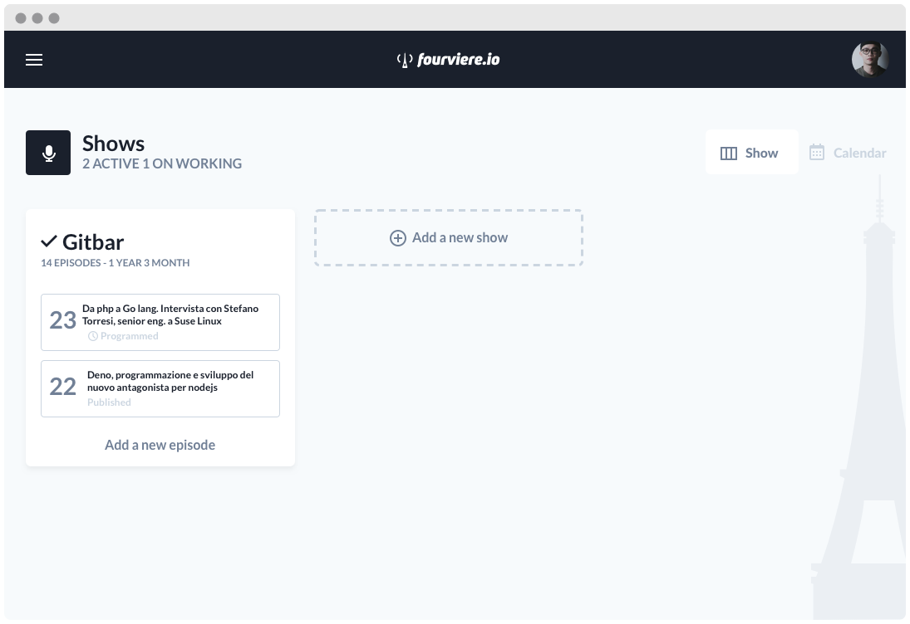

  

    

  

## Make your podcast independent from the platforms

Fourviere is a self hosting podcast cms allora you to host your podcast autonomously and cheaply.

If you already have a website you don’t need to dismiss it, you can integrate it easily because poddok is an **api first** cms.

## Features

### User

- [ ] Show ownership

### Show

- [x] Crud show

### Episode

- [x] Crud episode
- [ ] Agnostic upload podcast (local, aws s3, ftp, sftp)
- [ ] Extract infos from mp3: chapters, title , etc.
- [ ] Schedule episode

### Guest

- [ ] Crud guest

### Promote

- [ ] Publish Spotify, Apple podcast , google podcast
- [ ] Newsletter
- [ ] Share in social

### Analytics

- [ ] Misure listeners
- [ ] Misure play

## 👊🏻 Contributing

Thank you for considering contributing to Fourviere. All the contribution guidelines are mentioned [here](CONTRIBUTING.md).

You can have a look at the [CHANGELOG](CHANGELOG.md) for constant updates & detailed information about the changes. You can also follow the Twitter account for the latest announcements or just come say hi!: [@brainrepo](https://twitter.com/brainrepo).

## 📖 License

Fourviere is an open-sourced software licensed under the [MIT license](LICENSE.md).
